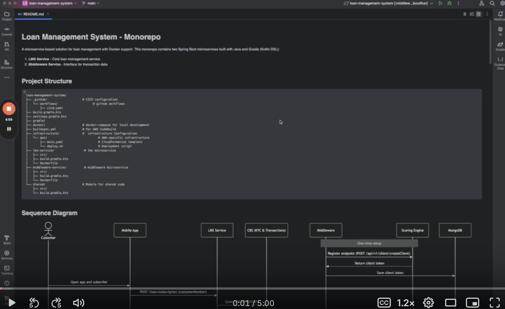

# Loan Management System - Monorepo

A microservice-based solution for loan management with Docker support. This monorepo contains two Spring Boot microservices built with Java and Gradle (Kotlin DSL):

1. **LMS Service** - Core loan management service
2. **Middleware Service** - Interface for transaction data

## Project Structure

```
loan-management-system/
├── .github/                    # CICD configuration
│   └── workflows/                    # github workflows
│       ├── cicd.yaml  
├── build.gradle.kts
├── settings.gradle.kts
├── gradle/
├── docker/                     # docker-compose for local development
├── buildspec.yml               # For AWS CodeBuild
├── infrastructure/             #  infrastructure Configuration
│   └── aws/                             # AWS-specific infrastructure
│       ├── main.yaml                    # CloudFormation template
│       └── deploy.sh                    # Deployment script
├── lms-service/                 # lms microservice
│   ├── src/
│   ├── build.gradle.kts
│   └── Dockerfile
├── middleware-service/          # middleware microservice
│   ├── src/
│   ├── build.gradle.kts
│   └── Dockerfile
└── shared/                     # Module for shared code
    ├── src/
    └── build.gradle.kts
```

## Sequence Diagram

![Sequence Diagram](https://mermaid.ink/svg/pako:eNqdVm1v2kgQ_isjSz0RCQKEkIA_VApQnaJrmlypVPXEl8UeYBV7191dk3IR__32zWAb0_TKF2zvzOzMM888u69BxGMMwkDi9xxZhDNK1oKkCwb6RyLFBUxzqXiKwn3LiFA0ohlhCh74kiYIRBZPd1l2avXxYW5MzN8cxZZGeGoznVgb89f669sU_oAvgjCpE6CcyYuGrWkcJ_hCREOwecQFZesPbE2Zzc5_APfl1GE2cTWwNZ9NFswZvHsH94wqShKQqPIMOiBwTaVCGys9JAAvVG1A-j2wtMcnrhD4FkUp3XYluxAeGXYUTdFt4vyO1p3372v2n30OeqM441Rn33p6nH-BLslod9vvRglFprqRQKJwal88fJVAHR35uI0Jq3LBwHmD4s_IGnKZTUKYky022B1AK-gCMl_KSNDMtBBWCX9xJsW6ScCyRmOQIQOSZUBYXLgtPYbORhtr_oTgSk04Yd1K-Fbko37K0yUKX7F20Y6aVCH8naPYgaHW3dM9tOaPd0_eSC93ivAFCkUJlK14OdShfhPILIqUmP2PNqWqfLBKnlIRlctKZSZDv18IMyqzhOyqThFnK1rZ6QD2R42EpqWeXal-jvFnb2SwewPZIl4N1Lb1vUt5fqDUEZXpBqNn0ICAmSIzCMbYVzqb1BE2ixUwvOAkypZkqIrAuNK1kXh3Bl6Zcc0XxSGXulcttUHtRCUQF36JJo1M8AilxPjiPOq_GQoTiTWt0PNuW-JnrYxSbY4d3l41utR7W5ra6ruvVfT3Z4a4jGppHD1YB8LaJVOgrUerXblNvhwWH6qpKiasUUlQR0WGmCgCK8HTEyGuJlgXGUeseqQGpSkNbfkkODe9DVL25iYNPRF8S2M843ocOn2SRYbv0hLe9BB_0uk_P5Qa_b3UYNuTfZ3_jdw_33pn7ql5oFz19LGGXwlVVmAFKlEKm3CeGcw00ilGG8KoTKGVkh8wBKIUppkqDuDi9_tlVnhm5sfn_0ulFoJqPUwllssJTamqMfh4GPE0S1DjkJSEslHRnSLZ0GVdatb0crRf1vSKk0CZJ6qerRXRkjZqCdbPG300mgOS7exFgazM8V-OdnFW9U8iNkm_7Zw7U4tdG4T_Pj4RfTefJ9HPyH2MitDkbVz_F57OOGgHeiklNNZX2Vfjugi0hqe4CEL9GBPxvAgWbK_tSK74fMeiIFQix3YgeL7eFC95pse9uAMH4YpohrYDfUf8h_O0MNKvQfga_AjC_vX4cjQcXA36g_GgPx72rtrBLghve5e96_F4cD26Gtzc9G6H-3bwrw3Quxxd9_u314PhaDy8vRmMxu0AY6pv2Q_uGm5v4_v_AMMZ1Z0)

## Screencast
[](https://www.canva.com/design/DAGinlK8aYM/uMgLEjNct2MGyuc3WRPnuw/edit?utm_content=DAGinlK8aYM&utm_campaign=designshare&utm_medium=link2&utm_source=sharebutton)


## Technology Stack

- **Language**: Java
- **Build Tool**: Gradle (Kotlin DSL)
- **Framework**: Spring Boot 3.1.5
- **Database**: MongoDB
- **Containerization**: Docker
- **API Integration**: REST and SOAP clients
- **Resilience**: Resilience4j for retries

## Getting Started

### Prerequisites

- JDK 17 or later
- Gradle 7.5 or later
- Docker and Docker Compose
- MongoDB (for local development)

### Setup Instructions

1. **Clone the repository**
   ```bash
   git clone https://github.com/kjacone/loan_management_system
   cd loan-management-system
   ```

2. **Build the project**
   ```bash
   ./gradlew build
   ```

3. **Run individual services locally**
   ```bash
   # Run LMS service
   ./gradlew :lms-service:bootRun

   # Run Middleware service
   ./gradlew :middleware-service:bootRun
   ```

4. **Run with Docker Compose**
   ```bash
   cd docker
   docker-compose up -d
   ```

## Services
### LMS Service (port 8080)

Manages loan operations including:
- Customer subscription
- Loan requests
- Loan status tracking

#### API Endpoints

- **POST /loan/subscription** - Subscribe a customer for loan eligibility
- **POST /loan/request** - Submit a loan request
- **GET /loan/status** - Check loan application status
- **GET /health** - Health check endpoint
- **GET /swagger-ui.html** - Swagger UI for API documentation

### Middleware Service (port 8081)

Handles transaction data processing and exposes APIs to the Scoring Engine.

#### API Endpoints

- **POST /middleware/transactions** - Retrieve customer transaction data
- **GET /health** - Health check endpoint
- **GET /swagger-ui.html** - Swagger UI for API documentation


## Docker Support

The project includes Dockerfiles for both services and a docker-compose file to run the entire system. The Docker setup includes:

- MongoDB container
- LMS Service container
- Middleware Service container
- Shared network for inter-service communication

## Development Workflow

1. Make changes to the codebase
2. Run tests: `./gradlew test`
3. Build the project: `./gradlew build`
4. Build and run Docker containers: `docker-compose up --build`

## External Service Integration

This system integrates with several external services:

1. **KYC API** - For customer verification
2. **Scoring Engine** - For loan eligibility scoring
3. **Transaction API** - For retrieving customer transaction data

## Deployment

The Loan Management System uses GitHub Actions for continuous integration and deployment to AWS. The system automatically builds, tests, and deploys services when changes are pushed to the repository.

### CI/CD Pipeline

Our CI/CD pipeline includes the following stages:

1. **Test**: Runs all tests to ensure code quality
2. **Build**: Builds the services and Docker images
3. **Infrastructure**: Deploys or updates AWS infrastructure using CloudFormation
4. **Services**: Updates ECS services with new container images
5. **Notification**: Reports deployment status

### Prerequisites

Before deploying, you need to set up the following:

1. **AWS Credentials**: Add these secrets to your GitHub repository:
   - `AWS_ACCESS_KEY_ID`: Your AWS access key
   - `AWS_SECRET_ACCESS_KEY`: Your AWS secret key

2. **Optional - Slack Notifications**: To enable Slack notifications, add:
   - `SLACK_WEBHOOK_URL`: Your Slack webhook URL

### Environments

The system supports three environments:
- `dev`: Automatically deployed when pushing to any branch except `main`
- `staging`: Can be deployed manually via workflow dispatch
- `prod`: Automatically deployed when pushing to the `main` branch

### Manual Deployment

You can manually trigger a deployment to any environment:

1. Go to the "Actions" tab in your GitHub repository
2. Select the "Loan Management System CI/CD" workflow
3. Click "Run workflow"
4. Choose the branch and environment
5. Click "Run workflow"
### Infrastructure

The deployment creates the following AWS resources:

- ECS Fargate cluster for containerized services
- ECR repositories for Docker images
- Amazon Bedrock database
- Application Load Balancers
- Security groups and IAM roles
- CloudWatch logs for monitoring

### Monitoring

Monitor your deployments:

1. In GitHub: Check the "Actions" tab for workflow runs
2. In AWS Console:
   - ECS console for container status
   - CloudWatch for logs and metrics
   - Amazon Bedrock console for database monitoring


### Deployment in Kubernetes

Kubernetes YAML files:

1. **mongodb-deployment.yaml**: Deployment configuration for MongoDB
1. **mongodb-service.yaml**: Service to expose MongoDB within the cluster
1. **mongodb-pvc.yaml**: PersistentVolumeClaim for MongoDB data storage
1. **lms-service-deployment.yaml**: Deployment for the LMS service
1. **lms-service-service.yaml**: Service to expose the LMS service
1. **middleware-service-deployment.yaml**: Deployment for the middleware service
1. **middleware-service-service.yaml**: Service to expose the middleware service

Build and push your container images to a registry before deploying to Kubernetes.
1. **lms-service:latest**  
2. **middleware-service:latest**

Update the image references as needed.
To deploy these files to your Kubernetes cluster, you can use:
```bash
# Replace the image names with your actual registry and image names
// 
kubectl apply -f mongodb-pvc.yaml
kubectl apply -f mongodb-deployment.yaml
kubectl apply -f mongodb-service.yaml
kubectl apply -f lms-service-deployment.yaml
kubectl apply -f lms-service-service.yaml
kubectl apply -f middleware-service-deployment.yaml
kubectl apply -f middleware-service-service.yaml
```
### Troubleshooting

Common issues:

1. **Failed Tests**: Check the test logs in the GitHub Actions run
2. **Deployment Failure**: Verify AWS credentials and permissions
3. **Service Unavailable**: Check ECS service status and logs

For additional help, refer to AWS documentation or contact the development team.

## Contributing

1. Create a feature branch (`git checkout -b feature/new-feature`)
2. Commit your changes (`git commit -m 'Add some new feature'`)
3. Push to the branch (`git push origin feature/new-feature`)
4. Open a Pull Request
